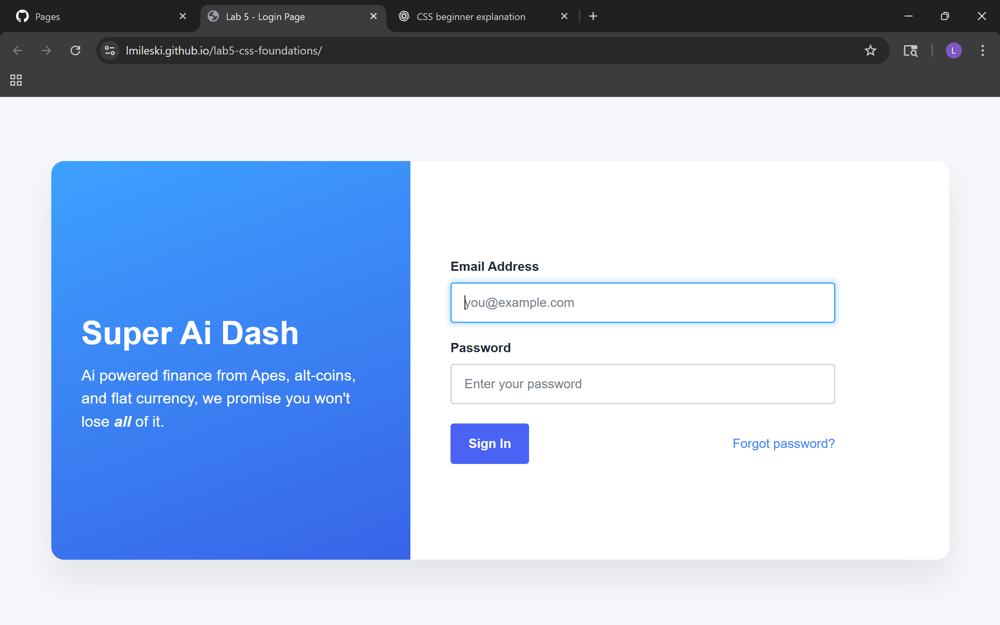
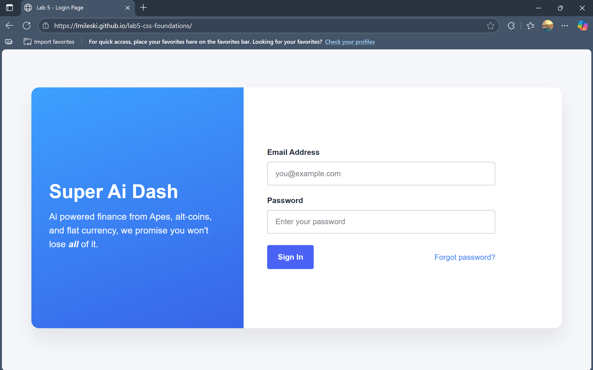
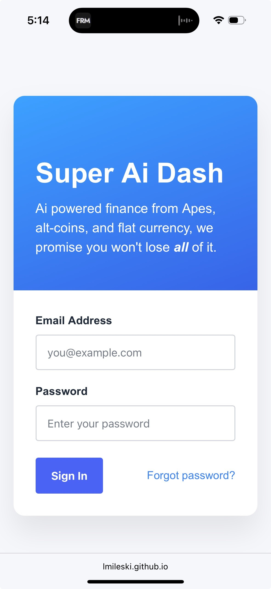

# lab5-css-foundations

**Author:** Luke Mileski  
**Email:** lmileski@sandiego.edu  
**Date:** October 7, 2025

---

## Overview
This project replicates the **Super Ai Dash Login Page**.  
The goal was to build a semantic and responsive login interface using **HTML5** and **modern CSS layout techniques** including **Grid**, **Flexbox**, and **custom properties (variables)**.

The page is divided into two main sections:
- A **blue gradient information panel** with the project title and short tagline.  
- A **white form section** that includes email and password inputs, a submit button, and a “Forgot password?” link.

---

## Live Site
[View on GitHub Pages](https://lmileski.github.io/lab5-css-foundations/)  

---

## File Structure
lab5-css-foundations/  
├── docs/  
│ ├── index.html  
│ ├── styles.css  
├── README.md

---

## Implementation Details

### **Semantic HTML**
- Usage of `<main>`, `<section>`, `<form>`, `<label>`, `<input>`, and `<button>` elements.  
- Created custom tags `<form-field>`, `<form-submission>`, and `<password-recovery>` and styled as block-level elements.

### **CSS Variables**
```css
--blue-1, --blue-2, --btn, --btn-hover, --text,
--border, --container-radius, --label-radius, --shadow
```

### **CSS Grid Layout**
- `.container` uses **Grid** to create two responsive columns:  
  ```css
  grid-template-columns: 2fr 3fr;
  ```
- `.container` collapses to one column with stacked sections on smaller devices:
  ```css
  @media (max-width: 56rem) {
  .container { grid-template-columns: 1fr; }
  }
  ```

### **Rendering in Different Browsers**
- **Google Chrome**



- **Microsoft Edge**



- **Safari from Mobile Device**



### **Reflections**
As someone new to HTML and CSS, this lab proved incredibly beneficial to my understanding of how the technology works. After completing this lab, I can confidently say I have a good general idea of the way both languages interact. I'm excited to see how JS comes into play here and add interactivity to a site like this. One main takeaway I had from this lab was that it's easy for us to just skim over the details. I know realize that a good site requires immense attention to detail, which is a skill all web developers and software engineers in general must have.